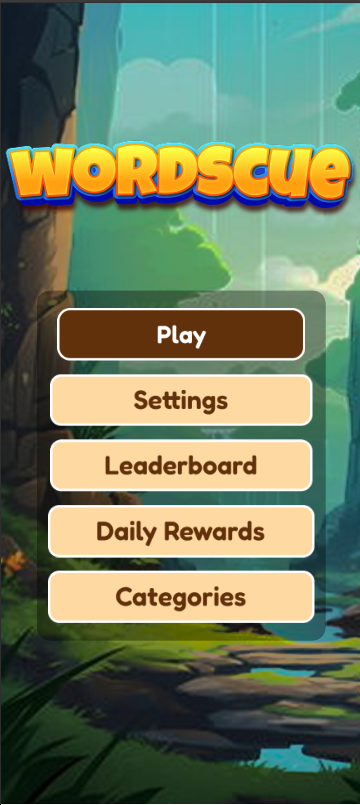
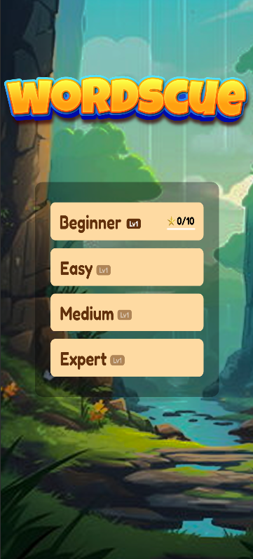
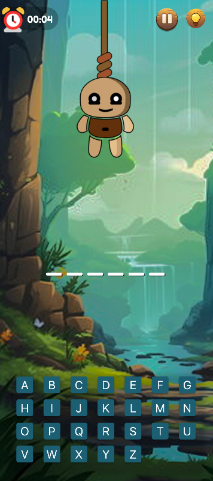
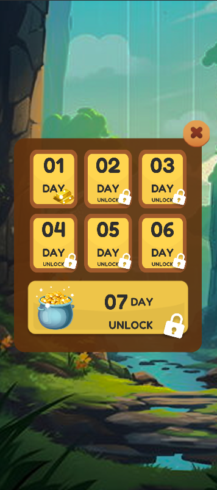
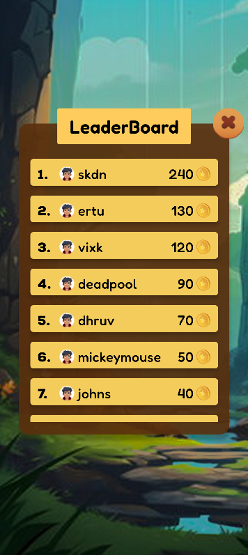

Here's a professional GitHub README.md for your Wordscue - Hangman Game.

🧠 Wordscue – The Ultimate Hangman Experience

Wordscue is a modern and engaging Hangman-style word guessing game built with Flutter and Firebase. Test your vocabulary, challenge yourself with multiple difficulty levels, earn rewards, compete on leaderboards, and enjoy an immersive gaming experience.

📱 Download on Google Play

🔗 Play Store Link:
https://play.google.com/store/apps/details?id=com.ext.wordscue&hl=en_IN

🎮 Features
🔐 Smart Authentication
One-time login experience.
User stays logged in after successful authentication.
Automatically navigates to the Home Screen on subsequent app launches.
🎯 Multiple Difficulty Levels

Choose your preferred challenge level:

Beginner
Easy
Medium
Hard

📚 9 Diverse Categories
Explore words from different themes and improve your vocabulary:

Animals
Countries
Food
Movies
And more...
⏱️ Timer Mode
## 📸 Screenshots

  
  
  

  
  
  

  

Play your way:
Enable a 5-minute timer for an exciting challenge.
Disable the timer and enjoy unlimited thinking time.
🎁 Daily Rewards
Earn 10 coins every 24 hours.
Use coins to unlock hints and improve your chances of winning.
🏆 Global Leaderboard
Compete with players worldwide.
Climb the rankings by achieving high scores.
Challenge your friends and track your progress.
🎵 Sound Effects & Background Music
Interactive sound effects.
Engaging background music.
Enhanced gaming experience.
🎨 Beautiful UI/UX
Modern Splash Screen.
Clean and user-friendly interface.
Smooth gameplay experience for all age groups.
📈 Educational Benefits
Improves vocabulary.
Enhances spelling skills.
Encourages learning through fun gameplay.

🛠️ Built With
Frontend
Flutter
Backend & Services
Firebase Authentication
Firebase Realtime Database
State Management

